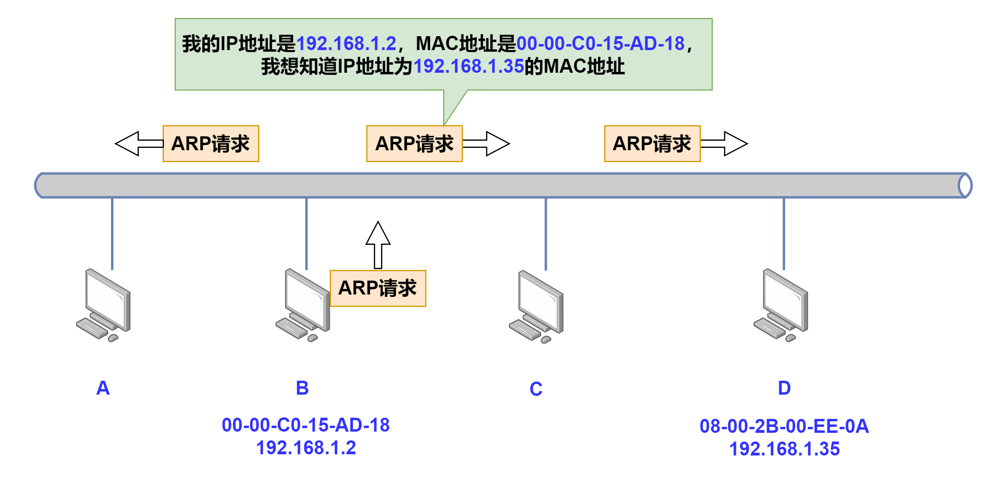
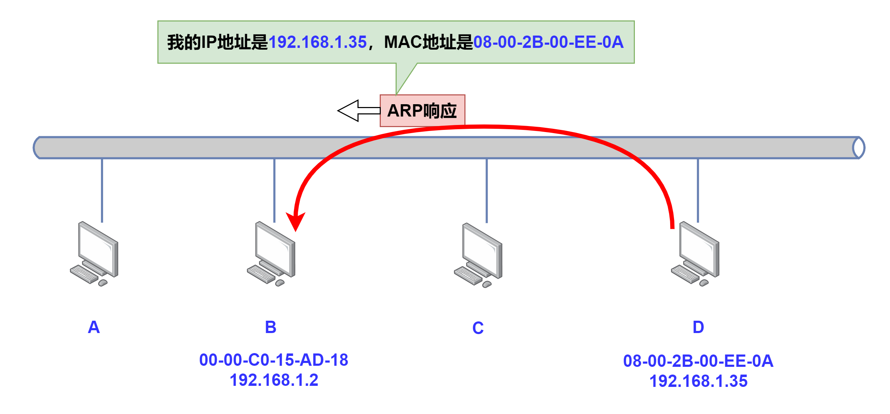
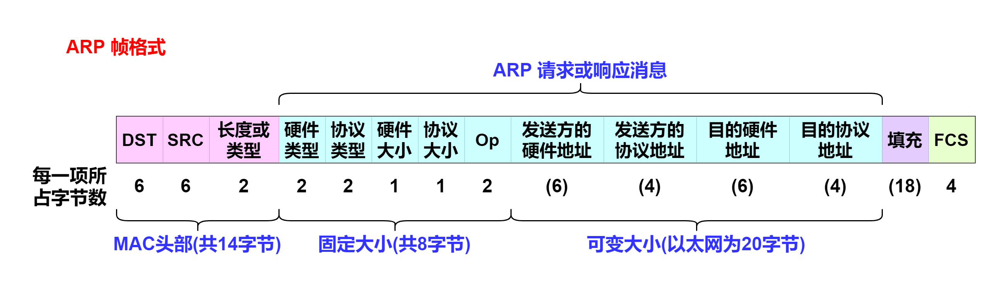

# 地址解析协议(ARP)

我们知道，网络层使用的是 IP 地址，而在实际网络的链路上传送数据帧时，最终还是必须使用链路层的 MAC 地址。所以，在链路上传送数据帧时只知道 IP 地址是不够的，我们还需要知道主机在网络中的有效 MAC 地址，那么有没有什么办法可以把 IP 地址转换为物理地址呢？那就要用 <mark style="color:blue;">**地址解析协议(ARP)**</mark> <mark style="color:blue;"></mark>\[RFC0826] 来解决这个问题了。

<mark style="color:blue;">**地址解析协议(Address Resolution Protocol, ARP)**</mark> 是一个通用的协议，从这个意义上来看，它被设计为支持多种地址之间的映射。也就是说 ARP 提供从网络层地址到相关硬件地址的动态映射。实际上， ARP 几乎总是用于 `32` 位 IPv4 地址和以太网的 `48` 位 MAC 地址之间的映射。

这里有一点需要注意，ARP 仅用于 IPv4 ， IPv6 使用 <mark style="color:blue;">**邻居发现协议(NDP)**</mark> <mark style="color:blue;"></mark>，它被合并入 ICMPv6 。

另外，还有一个提供 ARP 反向映射的协议称为 <mark style="color:blue;">**逆地址解析协议(RARP)**</mark> ，它能让知道自己 MAC 地址的主机通过 RARP 找出其 IP 地址，它在当前已很少使用。

### ARP 缓存

在每个主机中都有一个 <mark style="color:blue;">**ARP 高速缓存**</mark> ，该缓存使用地址解析为每个接口维护从网络层地址到硬件地址的最新映射，里面存放的是所在局域网上的各主机和路由器的 IP 地址到硬件地址的映射表。每一个 IPv4 地址映射到硬件地址对应于高速缓存中的一个条目，其有效时间为条目创建开始后的 20 分钟 \[RFC1122] 。

在 `Linux` 或者 `Windows` 中我们可以使用 `arp` 命令查看 <mark style="color:blue;">**ARP 缓存**</mark> 。例如，在我的 Windows 系统下查看 ARP 缓存如下。

```shell
C:\>arp -a

接口: 192.168.56.1 --- 0x8
  Internet 地址         物理地址              类型
  192.168.56.255        ff-ff-ff-ff-ff-ff     静态
  ...(后面省略)
```

在上述的例子中，显示了接口的 IPv4 地址 `192.168.56.1` ，而后跟着的是接口号 `0x8` ，这里用的是十六进制表示。当然，还给出了该条目的类型，如果是通过手工输入的就是静态的，来自 ARP 学习就是动态的，上面给出的例子是 `静态` 的。

再例如，我的 Linux 系统下查看 ARP 缓存如下。

```shell
caizi@ubuntu:~$ arp
Address                  HWtype  HWaddress           Flags Mask            Iface
192.168.152.1            ether   00:50:56:c0:00:08   C                     ens33
...(后面省略)
```

在上述的例子中，每个映射条目都包含了 `5` 个元素，分别是 <mark style="color:blue;">**Address(主机名)**</mark> 、 <mark style="color:blue;">**HWtype(硬件地址类型)**</mark>、 <mark style="color:blue;">**HWaddress(硬件地址)**</mark> 、<mark style="color:blue;">**Flags Mask (标志)**</mark>、<mark style="color:blue;">**Iface(本地网络接口)**</mark>。

其中，**Flags Mask (标志)** 包含一个符号， **C** 、 **M** 或 **P**。C 类条目由 ARP 协议动态学习，M 类条目由手工进行输入。P 类条目表示该缓存条目是“发布的”。对于任何 P 类的缓存条目，主机对输入的 ARP 请求都返回一个 ARP 响应。该选项用于配置代理 ARP 。

通过上面两个不同系统下 ARP 高速缓存表的显示还能发现，在 Linux 系统下 48 位的 MAC 地址是用 **冒号** 进行分隔的，而在 Windows 系统下是用 **短杆** 进行分隔的。传统上， UNIX 系统一直使用冒号，而 IEEE 标准和其他操作系统更倾向于使用短杆。

### ARP 工作原理

假设有一台主机想要向本地局域网上的另一台目标主机发送 IP 分组时，首先会在本地主机的 ARP 高速缓存中查询是否有目标主机的 IP 地址，如果有该 IP 地址对应的条目，则可以直接查出其 MAC 地址，写入 MAC 帧，然后通过局域网将该帧发送给对应 MAC 地址的主机上。



如果没有，则先通过广播 ARP 请求分组(如上图)，在获得目标主机的 ARP 响应分组后(如下图)，将目标主机的 MAC 地址写入 ARP 高速缓存，建立目标主机的 IP 地址到 MAC 地址的映射关系。注意： ARP 请求分组是广播发送的，但 ARP 响应分组是普通的单播。



当然，ARP 只是解决同一个局域网上的主机或路由器的 IP 地址和 MAC 地址的映射问题的。如果所要找的主机和源主机不在同一个局域网上，那么就要通过 ARP 找到一个位于本局域网上的某个路由器的硬件地址，然后把分组发送给这个路由器，让这个路由器把分组转发给下一个网络，剩下的工作就由下一个网络来做。

### ARP 帧格式




由图可见，前 `14` 个字节是 <mark style="color:blue;">**MAC(以太网)头部**</mark> ，其余部分由 ARP 协议定义。 ARP 帧的前 `8` 个字节是通用的，剩余部分用于将 IPv4 协议映射到 `48` 位的以太网地址。

首先让我们看看以太网头部，第一个字段是 `DST` 即 <mark style="color:blue;">**目的以太网地址**</mark> ，第二个字段是 `SRC` 即 <mark style="color:blue;">**源以太网地址**</mark> <mark style="color:blue;"></mark>。这里需要注意一点，对于一个 ARP 请求来说，目的地址字段填充的是以太网地址 `ff:ff:ff:ff:ff:ff` ，即以太网广播地址，这样在同一个广播域中的每个接口都能收到该帧。第三个字段是 <mark style="color:blue;">**长度或类型**</mark> ，此字段占据 `2` 字节大小，对于 ARP 请求或响应该字段的值一定为 `0x0806` 。

接下来的 4 个字段指定了最后 4 个字段的类型和大小 \[RFC5494]。

<mark style="color:blue;">**硬件类型字段**</mark> 指出硬件地址类型。对于以太网，硬件类型字段值为 `1` 。&#x20;

<mark style="color:blue;">**协议类型字段**</mark> 指出映射的协议地址类型。对于 IPv4 ，协议类型字段的值为 `0x800` 。

<mark style="color:blue;">**硬件大小字段**</mark> 指出硬件地址的字节数。对于以太网中使用 IPv4 地址的 ARP 请求或响应，硬件大小字段的值为 `6` 。&#x20;

<mark style="color:blue;">**协议大小字段**</mark> 指出协议地址的字节数。对于以太网中使用 IPv4 地址的 ARP 请求或响应，协议大小字段的值为 `4` 。&#x20;

<mark style="color:blue;">**操作码字段(Op)**</mark> 指出该报文所执行的操作。 当 `Op = 1` 时，该报文为 `ARP 请求报文` ； 当 `Op = 2` 时，该报文为 `ARP 响应报文` ； 当 `Op = 3` 时，该报文为 `RARP 请求报文` ； 当 `Op = 4` 时，该报文为 `RARP 响应报文` 。

接下来的字段指出了发送方和目的的硬件地址和协议地址。&#x20;

<mark style="color:blue;">**发送方硬件地址字段**</mark> 指出了发送方的以太网 MAC 地址。&#x20;

<mark style="color:blue;">**发送方协议地址字段**</mark> 指出了发送方的 IPv4 地址。&#x20;

<mark style="color:blue;">**目的硬件地址字段**</mark> 指出了目的地的以太网 MAC 地址。&#x20;

<mark style="color:blue;">**目的协议地址字段**</mark> 指出了目的地的 IPv4 地址。

接下来是 <mark style="color:blue;">**填充字段**</mark> ，当要发送一个 ARP 请求时，除了目的硬件地址设为 `0` 之外，其他字段都需要进行填充。

### ARP 的 4 种典型情况总结：

1. 发送方是主机，要把 IP 数据报发送到本网络上的另一个主机。这时用 ARP 找到目的主机的硬件地址。
2. 发送方是主机，要把 IP 数据报发送到另一个网络上的一个主机。这时用 ARP 找到本网络上的一个路由器的硬件地址，剩下的工作由这个路由器来完成。
3. 发送方是路由器，要把 IP 数据报转发到本网络上的一个主机。这时用 ARP 找到目的主机的硬件地址。
4. 发送方是路由器，要把 IP 数据报转发到另一个网络上的一个主机。这时用 ARP 找到本网络上的一个路由器的硬件地址，剩下的工作由这个路由器来完成。
