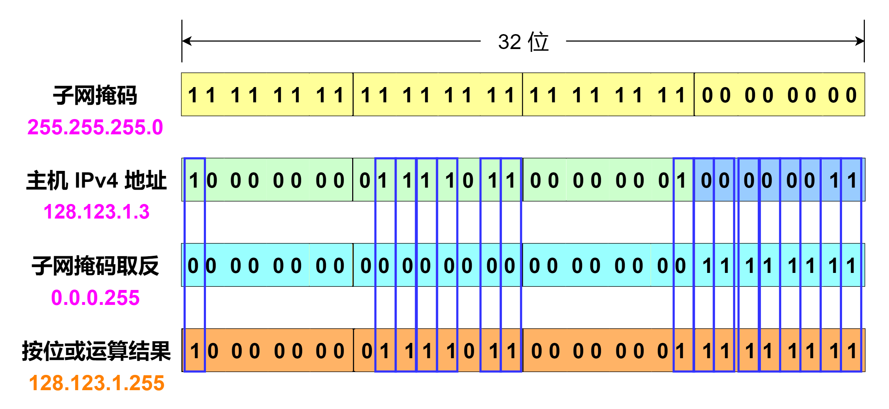

# 广播地址

**广播地址(Broadcast Address)** 是专门用于向网络中所有设备进行发送的网络地址。发送到广播地址的消息可以被所有网络连接的主机接收。而 **多播地址** 是用于向特定的一组设备进行发送的网络地址。 **单播地址** 是用于向某个特定的设备进行发送的网络地址。

在 IPv4 中，主机的广播地址可以通过取 子网掩码 的按位非运算，再和主机的 IP 地址进行按位或运算获得。下图是一个获取 IPv4 主机的广播地址的例子。假设一台主机 IPv4 地址为 `128.123.1.3` ，主机所属的站点子网掩码为 `255.255.255.0` ，要计算该网络广播地址。首先就要将子网掩码进行按位非运算，得到的结果为 `0.0.0.255` ，然后用此结果 `0.0.0.255` 与主机 IPv4 地址 `128.123.1.3` 进行按位或运算，得到结果为 `128.123.1.255` ，即该网络的广播地址。

当然，你也可以简单的认为主机号全为 `1` 的 IP 地址就是广播地址。广播的分组发送给该网段所涉及的所有计算机。就如上面的例子，当发出一个目的地址为 `128.123.1.255` 的分组时，该分组将发送给该网段上的所有计算机。

除了上面讲到的这种 **直接广播** ，还有另一类 **受限广播** ，即它永远不会被本地网络连接到其他网络的路由器转发。这个特殊定义的 IP 地址为 `255.255.255.255` ，它是 **零网络** 或 `0.0.0.0` 的广播地址，在 Internet 协议标准中代表 **此网络** ，即 **本地网络** ，它永远不会被路由器转发。

在 IPv6 中没有实现这种广播方法，因此没有定义广播地址。而 IPv6 使用多播地址向多播组所有主机发送分组。
