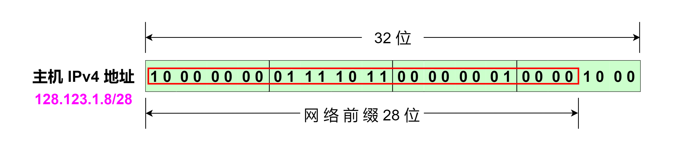
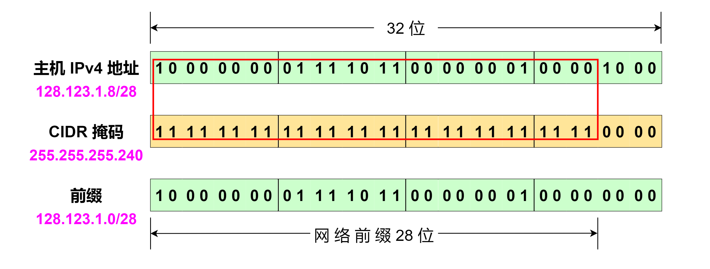
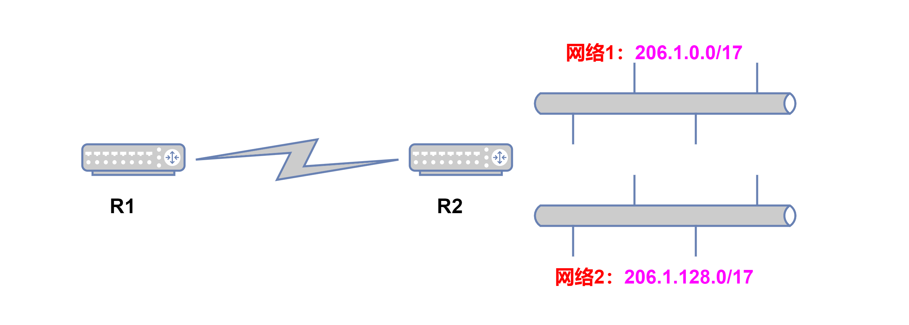

# 无类别域间路由(CIDR)

随着网络的快速发展，按以前划分 IP 地址的分类方法， B 类地址基本上很快用尽，而且基于以前分类网络进行地址分配和路由 IP 数据包的设计就已经明显显得可扩充性不足。

按以前 IP 地址分类，一个 IP 地址分成两部分，用于识别接口网络的 **网络号** 以及识别这个网络中特定主机的 **主机号** 。而且，按照以前的分类方法，每类中的网络号位数都是固定的，例如 A 类地址网络号一定为 8 位， B 类地址网络号一定为 16 位， C 类地址网络号一定为 24 位。如果给一个企业分配一个 C 类地址，该企业只能分配到 $$2^{8} = 256$$ 个地址，这显得太少了。但是给一个企业分配一个 B 类地址，该企业又能分配到 $$2^{16} = 65536$$ 个地址，这又显得太多了。因此，为了解决 IPv4 地址快要分配完的压力，以及减缓互联网中路由器的路由表表项的增长，后来出现了一个类似 `可变长度子网掩码(VLSM)` 的分类寻址方案，以支持 **无类别域间路由(Classless Inter-Domain Routing, CIDR)** 。

无类别域间路由(CIDR)是一个用于给用户分配 IP 地址以及给路由分配 IP 地址的方法。在 CIDR 中，消除了之前划分 IP 地址以及划分子网的概念，它将 IP 地址分为两部分，第一部分称之为 **最高有效位** 或者 **网络前缀** ，它用来标识一个网络；第二部分称之为 **最低有效位** 或者 **主机标识符** ，它用来标识主机。也就是说，允许 IP 地址的网络号长度是可变的，不再按照以前 IP 地址的网络号只能是 `8` 位、 `16` 位或者 `24` 位。

例如，下面给出了一个 IPv4 地址 `128.123.1.8` ，其中，用了红色方框框起来的是 _网络前缀_ ，图中可见该网络前缀为 `28` 位，而剩下的 `4` 位为主机标识符。

由此可知，对于 IPv4 网络前缀的值可以在 `0 ~ 32` 之间，而 IPv6 网络前缀的值可以在 `0 ~ 128` 之间。对于上面的例子来说，使用该网络前缀能分配的地址范围是 `128.123.1.0` \~ `128.123.1.15` 。

在 CIDR 中还引入了一种类似于子网掩码的掩码，通常称之为 **CIDR 掩码** 或者 **掩码** ，一般使用 **CIDR 表示法** 表示。CIDR 表示法是在 IP 地址后面追加一个斜杠 `/` 和一个数字，数字表示该 IP 地址的网络前缀长度。网络前缀所占比特数对应于网络号的部分，等效于子网掩码连续 `1` 的部分。

例如 CIDR 表示法表示的 IPv4 地址 `128.123.1.8/28` ，它的 CIDR 掩码是 28 个连续的 `1` 和后续 4 个连续的 `0` ，即用点分十进制表示法表示为 `255.255.255.240` ，如下图。通过把 `IPv4 地址` 和 `CIDR 掩码` **相与** 的方法，我们就能得到该地址的网络前缀，当然，直接截取 IP 地址的前 n 位也是可以获得其网络前缀的，这里的 n 指的是网络前缀的长度。

下面是一些前缀的例子。加粗的部分为其网络前缀。

| 前缀(CIDR表示法)    | 前缀(二进制表示法)                                                                                                                                                               | 地址范围                             |
| -------------- | ------------------------------------------------------------------------------------------------------------------------------------------------------------------------ | -------------------------------- |
| 128.0.0.0/1    | **1**000000 00000000 00000000 00000000                                                                                                                                   | 128.0.0.0 \~ 255.255.255.255     |
| 128.123.1.0/28 | **10000000 01111011 00000001 0000**0000                                                                                                                                  | 128.123.1.0 \~ 128.123.1.15      |
| 2001:dba::/32  | 
<strong>0010000000000001 0000110110111010</strong> 0000000000000000 0000000000000000 0000000000000000 0000000000000000 0000000000000000 0000000000000000
 | 2001:dba:: \~ 2001:dba:ffff:ffff |

虽然通过取消以前 IP 地址的分类，可以更好地分配适当大小的 IP 地址块，但是没有解决减少路由表条目数。为了解决这个问题，可以采用一个称为 **路由聚合** 的过程来实现。将相邻的多个 IP 前缀合并成一个短前缀，可以覆盖更多的地址空间。例如下面的网络，如果不使用路由聚合，路由器 R1 的路由表中需要有到 `网络 1` 和 `网络 2` 的路由表项， `网络 1` 为 `206.1.0.0/17` ， `网络 2` 为 `206.1.128.0/17` ，转化为二进制表示，可以看到它们的网络前缀的前 16 位是相同的，第 17 位分别是 0 和 1 。所以我们可以采用路由聚合，把 `网络 1` 和 `网络 2` 构成一个更大的地址块 `206.1.0.0/16` ，这样路由器 R1 的路由表项就能减少到 1 项。

