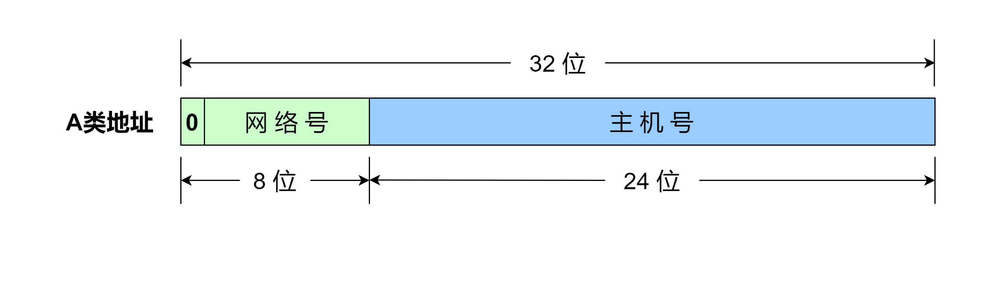
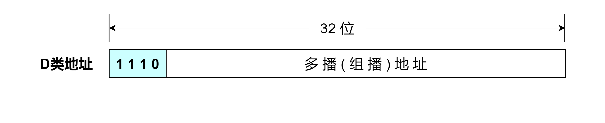
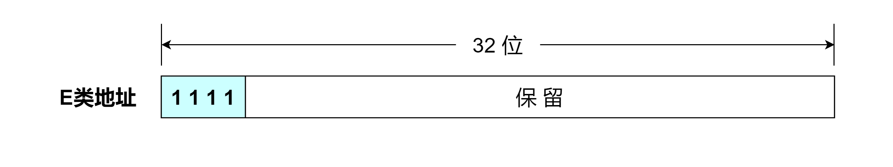

# IP地址分类

在互联网发展的早期， IPv4 地址空间分为五大类，`A类`（地址以 `0` 开头）、`B类`（地址以 `10` 开头）、`C类`（地址以 `110` 开头）、`D类`（地址以 `1110` 开头）、`E类`（地址以 `1111` 开头）。其中，A类、B类和C类都是**单播地址**，地址块中的第一个和最后一个地址通常不使用，D类是**多播（组播）地址**，E类是**保留地址**。每个_单播 IP 地址_都分为两部分，最开始的部分称为**网络号**，用于识别接口使用的 IP 地址可以在哪个网络中被发现，除网络号的部分称为**主机号**，用于在给定网络号的网络中识别特定的主机。假设网络号有 `n` 位，由 IPv4 地址定义，主机号为 `32 - n` 位。

### A 类地址

A 类地址的网络号长度为 1 字节，即 8 位，但第一位已经固定为 `0` ，所以只有 7 位可以自由使用。网络号全为 0 的 IP 地址表示“本网络”，而网络号为 01111111（127） 的 IP 地址保留作为本地软件 **环回测试(loopback test)** 使用。因此，A 类地址可以指派的网络号为 $$2^{7}-2$$ ，即 126 个。主机号长度一共 3 字节，即 24 位。主机号全为 0 表示该 IP 地址是当前主机所连接到的网络地址。网络号全为 1 表示当前网络上的所有主机。因此，一个 A 类网络中可以指派的主机数为 $$2^{24}-2$$ 个，即 16 777 214 个。A 类地址共 $$2^{31}$$ 个，占整个 IP 地址空间的 50% 。

### B 类地址

.png>)

B 类地址的网络号长度为 2 字节，即 16 位，但前两位已经固定为 `10` ，所以只有 14 位可以自由使用。因此，一个 B 类网络中可以指派的主机数为 $$2^{16}-2$$ 个，即 65 534 个。B 类地址共 $$2^{30}$$ 个，占整个 IP 地址空间的 25% 。

### C 类地址

.png>)

C 类地址的网络号长度为 3 字节，即 24 位，但前三位已经固定为 `110` ，所以只有 21 位可以自由使用。因此，一个 C 类网络中可以指派的主机数是 $$2^{8}-2$$ 个，即 254 个。C 类地址共 $$2^{29}$$ 个，占整个 IP 地址空间的 12.5% 。

### D 类地址

D 类地址不分网络号和主机号，是一个专门保留的地址，用于多播（组播）。前四位固定为 `1110` ，其地址范围为 `224.0.0.0` \~ `239.255.255.255` 。多播组 IP 地址让源主机能够将分组发送给网络中的一组主机，属于多播组的主机将被分配一个多播组 IP 地址。由于多播组 IP 地址标识了一组主机，因此多播组 IP 地址只能作为目标地址，源地址总是为单播地址。D 类地址占整个 IP 地址空间的 6.25% 。

### E 类地址

E 类地址同样不分网络号和主机号，是一个专门保留的地址，为将来使用保留。前四位固定为 `1111` ，其地址范围为 `240.0.0.0` \~ `255.255.255.255` ，其中 `255.255.255.255` 被用作**广播地址**。E 类地址占整个 IP 地址空间的 6.25% 。

表：最初的IPv4地址空间划分

|  类  | 地址范围                         |  高序位 | 用途    | 百分比  | 网络数       | 主机数        |
| :-: | ---------------------------- | ---: | ----- | ---- | --------- | ---------- |
|  A  | 0.0.0.0 \~ 127.255.255.255   |    0 | 单播/特殊 | 1/2  | 128       | 16 777 216 |
|  B  | 128.0.0.0 \~ 191.255.255.255 |   10 | 单播/特殊 | 1/4  | 16 384    | 65 536     |
|  C  | 192.0.0.0 \~ 223.255.255.255 |  110 | 单播/特殊 | 1/8  | 2 097 152 | 256        |
|  D  | 224.0.0.0 \~ 239.255.255.255 | 1110 | 组播    | 1/16 | N/A       | N/A        |
|  E  | 240.0.0.0 \~ 255.255.255.255 | 1111 | 保留    | 1/16 | N/A       | N/A        |

注：表中的网络数和主机数包含特殊的地址。
