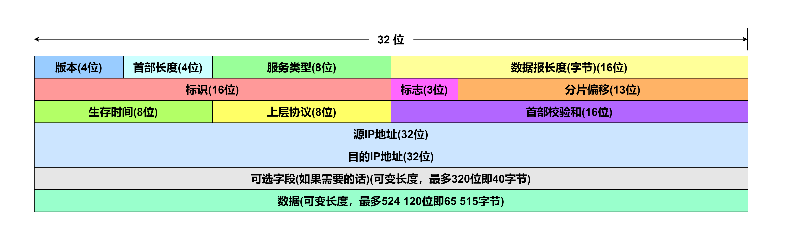
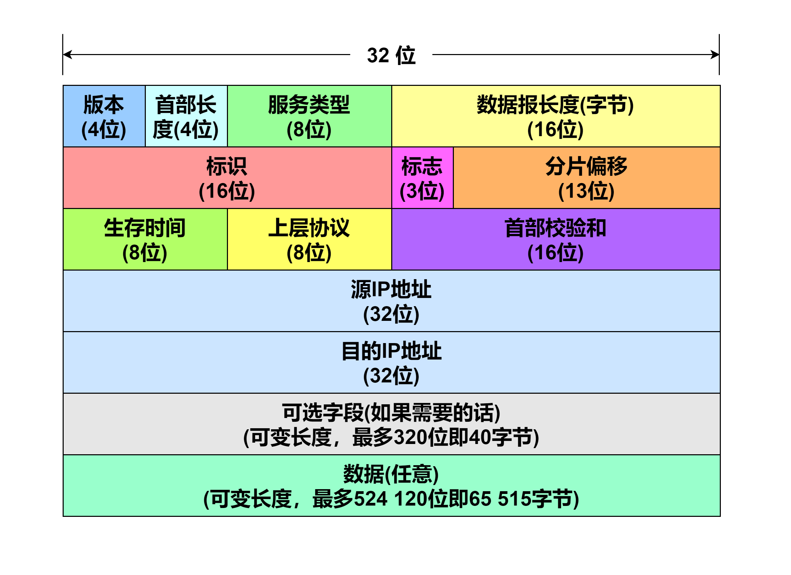
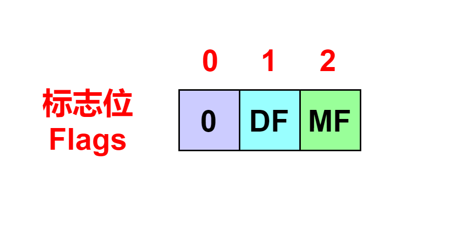
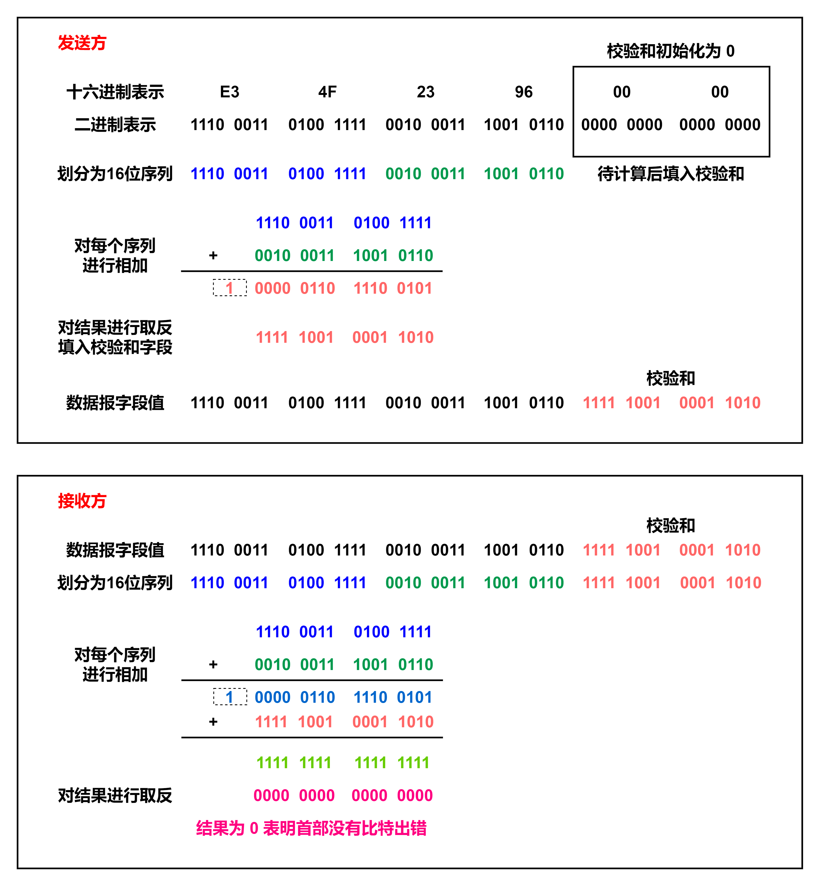

# IPv4数据报格式

上图给出了 **IPv4 数据报** 的格式。

在 IP 数据报中，最高有效位在左侧且编号为 `0` ，一个 `32` 位值的最低有效位在右侧且编号为 `31` 。一个 `32` 位值的 `4` 字节按以下顺序传输：首先是 `0 ~ 7` 位，然后是 `8 ~ 15` 位，接着是 `16 ~ 23` 位，最后是 `24 ~ 31` 位。这就是所谓的 **高位优先** 字节序，它被称为 **网络字节序** 。计算机的 CPU 使用其他格式存储二进制整数，例如大多数 PC 使用低位优先字节序，在传输时必须将首部值转换为网络字节序，并在接收时再转换回来。

下面介绍了各个字段的长度以及其作用。

<mark style="color:blue;">**版本(Version)**</mark> 字段，只占据 `4` 位即半个字节。它用于标识该数据报的 IP 版本号，对于 IPv4 来说，此值为 `4` ；对于 IPv6 来说，此值为 `6` 。 IPv4 首部和 IPv6 首部除版本字段位置相同外再无其他是一样的。通过版本号，路由器能确定如何解释该 IP 数据报的剩余部分。

<mark style="color:blue;">**Internet 首部长度(IHL)**</mark> 字段，只占据 `4` 位即半个字节。因为 IPv4 数据报首部可以包含可选字段，所以需要用此字段确定该 IP 数据报的首部长度。该字段的单位是 `32` 位字长(即 `4` 个字节)，也就是说当该字段的值为 `1` 时，表示的是首部长度为 `1 * 32 = 32` 位即 `1 * 4 = 4` 个字节。正常的 IPv4 首部固定部分大小为 `20` 字节，即此字段的值为 `5` (即二进制的 `0101` )。又因为该字段只有 `4` 位大小，最大只能表示 `15` ，所以 IPv4 的首部最多只能有 `60` 个字节长。

<mark style="color:blue;">**服务类型(Type of Service)**</mark> <mark style="color:blue;"></mark>字段，该字段占据 `8` 位即一个字节，这是根据最初的 IPv4 规范\[RFC0791]所指定的，由于它实际上并没有被广泛使用，后来此字段被划分为两个部分，目前，前 `6` 位被划分为 <mark style="color:blue;">**区分服务(Differentiated Services)**</mark> 字段，和后 `2` 位的 <mark style="color:blue;">**显式拥塞通知(ECN)**</mark> 字段\[RFC2474, RFC3168, RFC3260]，关于此字段下一次再详细讲解。

<mark style="color:blue;">**数据报长度(Total Length)**</mark> <mark style="color:blue;"></mark>字段，该字段占据 `16` 位即两个字节，此字段以字节为单位，该字段用于表示该 IP 数据报的总长度(包含首部和数据)。因为该字段只占据 `16` 位，所以 IP 数据报的最大理论长度为 `65 535` 字节，但实际上 IP 数据报很少有超过 `1500` 字节的，为的是使 IP 数据报能容纳最大长度的以太网帧的载荷。同时，通过此字段和 Internet 首部长度(IHL) 字段能确定数据部分的起始位置，以及数据部分的长度。当然，一个 IPv4 数据报被分为多个更小的分片时，该字段表示的是当前具体分片的总长度。

<mark style="color:blue;">**标识(Identification)**</mark> <mark style="color:blue;"></mark>字段，该字段占据 `16` 位即两个字节，此字段是发送方分配的一种识别值，用于帮助组装数据报的分片。因为有些 IP 数据报的长度超过数据链路层协议规定的单个数据帧最大的长度，所以需要对 IP 数据报进行分片。发送方在存储器中维持一个计数器，每产生一个分片的 IP 数据报就将该计数器值加一，最后将该计数器的值赋值给所有分片的 IP 数据报中的此字段。相同的标识字段的值使分片后的 IP 数据报最后能重装为原来的数据报。

<mark style="color:blue;">**标志(Flags)**</mark> 字段，该字段占据 `3` 位，此字段的第一位始终为 `0` 。第二位称为 <mark style="color:blue;">**DF(Don't Fragment)**</mark> 表示不能分片，当 `DF = 0` 时允许分片； 当 `DF = 1` 时不允许分片。第三位称为 <mark style="color:blue;">**MF(More Fragment)**</mark> 表示该分片的 IP 数据报是否为若干数据报的最后一个，当 `MF = 0` 时表示当前数据报为分片后的最后一个数据报；当 `MF = 1` 时表示后面还有分片。

<mark style="color:blue;">**分片偏移(Fragment Offset)**</mark> <mark style="color:blue;"></mark>字段，该字段占据 `13` 位，此字段指示此分片在原来的数据报中所属的相对位置。分片偏移量以 `8` 个字节(即 `64` 位)为偏移单位。第一个分片的偏移量为零。除了最后一个数据报分片外，其他每个分片的长度一定是 `8` 字节的整数倍。

<mark style="color:blue;">**生存时间(Time to Live, TTL)**</mark> <mark style="color:blue;"></mark>字段，该字段占据 `8` 位即一个字节，用于设置一个数据报可经过路由器数量的上限，该字段的作用是确保数据报不会永远在网络中循环传输。发送方将该字段初始化为某个值(例如按照\[RFC1122]中的建议设置为 `64` )，每经由一台路由器处理数据报时，该字段的值减一。若该字段的值减至 `0` ，则该 IP 数据报必须丢弃，并使用一个 ICMP 报文通知发送方。(注：在最初此字段指定 IP 数据报的最大生存期在几秒内，每经过一个路由器就把此字段的值减去数据报在路由器消耗的时间，如果小于 1 秒也进行减一处理，但实际上路由器通常不会处理数据报超过 1 秒钟，所以后来在 IPv6 中将其重新命名为跳数限制。)

<mark style="color:blue;">**上层协议(Protocol)**</mark> 字段，该字段占据 `8` 位即一个字节，表示数据报数据部分应该交给哪个特定的运输层协议处理。最常用的像 `UDP` 此字段值为 `17` 或者 `TCP` 此字段值为 `6` 。这个字段使 IP 协议可以用于携带多种协议类型的有效载荷。下面给出了一些常见的协议名称以及对应的上层协议字段值，如果想要获取更全的信息，请访问 http://www.iana.org/assignments/protocol-numbers/protocol-numbers.xhtml 。

| 协议名称 | 上层协议字段值 |
| ---- | ------- |
| ICMP | 1       |
| IGMP | 2       |
| IP   | 4       |
| TCP  | 6       |
| EGP  | 8       |
| IGP  | 9       |
| UDP  | 17      |
| IPv6 | 41      |
| OSPF | 89      |

<mark style="color:blue;">**首部校验和(Header Checksum)**</mark> 字段，该字段占据 `16` 位即两个字节，该字段用于帮助路由器检测收到的 IP 数据报中的比特错误，注意，这个检测只检测 IP 数据报的首部，不包含其数据部分。这也就意味着上层协议必须通过自己的方法检测数据的完整性。更有一点需要注意的是，因为每经过一个路由器其首部 TTL 字段进行了减一操作，所以其首部校验和必须更改。

**Internet 校验和** 是一个 `16` 位的数字和，但它与常见的 **循环冗余校验(CRC)** 不一样，接下来，让我们看看首部校验和是如何计算的。

* 在发送方，首先将数据报的校验和字段值设置为 `0` ，然后，把 IP 数据报首部划分为多个 `16` 位(即两个字节)的序列，<mark style="color:red;">**不包括校验字段**</mark>。对每个序列进行二进制 **求和** ，求和可以通过循环进位加法实现，然后再对结果进行 **取反** 操作，最后将得到的结果写入 IP 数据报的首部校验和字段。
* 在接收方，收到数据报后，同样将 IP 数据报首部划分为多个 `16` 位(即两个字节)的序列，<mark style="color:red;">**包括校验字段**</mark>。对每个序列进行二进制 **求和** ，然后再对结果进行 **取反** 操作，如果首部没有出错，该结果必定为 `0` ，否则数据报首部出错将该数据报丢弃。

下图给出了一个计算的例子，为了表示方便，简化了数据报格式。

<mark style="color:blue;">**源 IP 地址(Source Address)**</mark> <mark style="color:blue;"></mark>字段，该字段表示发送此 IP 数据报的主机接口的 IP 地址。

<mark style="color:blue;">**目的 IP 地址(Destination Address)**</mark> 字段，该字段表示接收此 IP 数据报的主机接口的 IP 地址。

<mark style="color:blue;">**可选(Options)**</mark> <mark style="color:blue;"></mark>字段，该字段允许 IP 数据报首部被扩展，但因为处理性能等问题，该选项字段已经在 IPv6 首部中去除。

<mark style="color:blue;">**数据(Data)**</mark> 字段，该字段存储 IP 数据报的数据。
