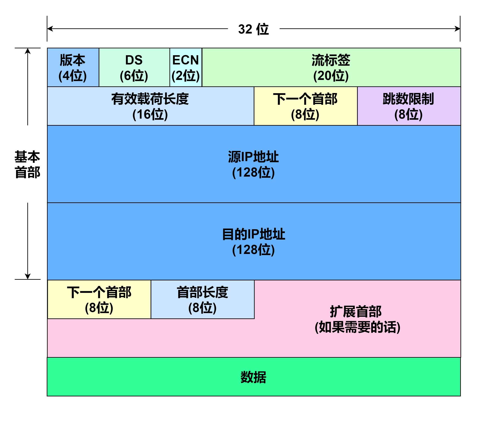
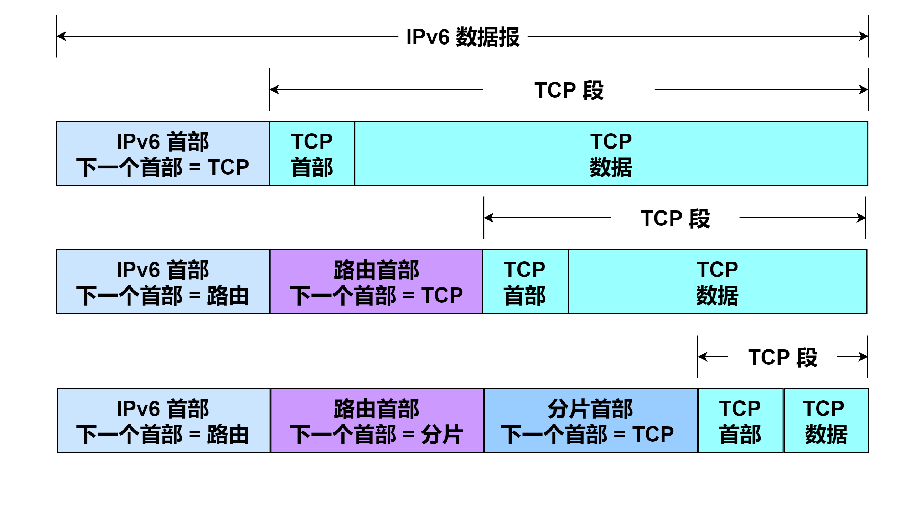

# IPv6数据报格式

.png)

IPv6 首部长度固定是 `40` 字节，没有任何选项，但它可以有扩展头部。

<mark style="color:blue;">**版本(Version)**</mark> <mark style="color:blue;"></mark>字段，只占据 `4` 位即半个字节。它用于标识该数据报的 IP 版本号，对于 IPv6 来说，此值为 `6` 。通过版本号，路由器能确定如何解释该 IP 数据报的剩余部分。

<mark style="color:blue;">**区分服务(DS)**</mark> 字段，只占据 `6` 位。

<mark style="color:blue;">**显式拥塞通知(ECN)**</mark> <mark style="color:blue;"></mark>字段，只占据 `2` 位。

<mark style="color:blue;">**流标签(Flow Label)**</mark> <mark style="color:blue;"></mark>字段，占据 `20` 位。简单来说， IPv6 的“流”指的是互联网络上特定源点到特定终点的一系列数据报，而在这个“流”所经过的路径上的路由器都保证服务质量。所有属于同一个“流”的数据报都有相同的“流”标签。

<mark style="color:blue;">**有效载荷长度(Payload Length)**</mark> 字段，该字段占据 `16` 位即两个字节，此字段以字节为单位，该字段用于表示该 IP 数据报的有效载荷长度(不包括基本首部)。因为该字段只占据 `16` 位，所以 IP 数据报的最大有效载荷长度为 `65 535` 字节即 `64` KB。

<mark style="color:blue;">**下一个首部(Next Header)**</mark> <mark style="color:blue;"></mark>字段，占据 `8` 位即一个字节。下一个首部字段用于说明 IPv6 首部之后其他扩展首部的存在和类型，它们形成一条包括特殊扩展或处理指令的首部链(见下面关于扩展首部的介绍)。也就是说，当 IPv6 没有扩展首部时，该字段相当于 IPv4 的协议字段，指明基本首部后面的数据应该交给 IP 层上面哪个高层协议处理；当 IPv6 有扩展首部时，该字段指明了后面第一个扩展首部的类型。

<mark style="color:blue;">**跳数限制(Hop Limit)**</mark> <mark style="color:blue;"></mark>字段，占据 `8` 位即一个字节。用于设置一个数据报可经过路由器数量的上限，最大跳数为 `255` 跳，该字段的作用是确保数据报不会永远在网络中循环传输。每经由一台路由器处理数据报时，该字段的值减一。若该字段的值减至 `0` ，则该 IP 数据报必须丢弃。

<mark style="color:blue;">**源 IP 地址(Source Address)**</mark> <mark style="color:blue;"></mark>字段，该字段表示发送此 IP 数据报的主机接口的 IP 地址。对于 IPv6 来说占据 `128` 位。

<mark style="color:blue;">**目的 IP 地址(Destination Address)**</mark> 字段，该字段表示接收此 IP 数据报的主机接口的 IP 地址。对于 IPv6 来说占据 `128` 位。

<mark style="color:blue;">**扩展首部(Extension Headers)**</mark> <mark style="color:blue;"></mark>字段，可以由若干个字段组成，但第一个字段都是 `8` 位的 下一个首部 字段，该字段指明了在该扩展首部后面是否还有另一个扩展首部，若还有扩展首部，则该字段值为下一个扩展首部的协议值。若没有扩展首部，则该值为 `59` ，也就是表示当前首部是这个首部链的结尾。首部链的示例如下图所示。

下表给出了 <mark style="color:blue;">**下一个首部**</mark> 字段值可能表示的扩展首部或其他协议首部。

| 首部类型         |  顺序  |  值  |
| ------------ | :--: | :-: |
| IPv6 首部      |   1  |  41 |
| 逐跳选项(HOPOPT) |   2  |  0  |
| 目的地址项        | 3, 8 |  60 |
| 路由           |   4  |  43 |
| 分片           |   5  |  44 |
| 封装安全载荷(ESP)  |   7  |  50 |
| 认证(AH)       |   6  |  51 |
| 移动(MIPv6)    |   9  | 135 |
| (没有下一个首部)    |  最后  |  59 |
| ICMPv6       |  最后  |  58 |
| UDP          |  最后  |  17 |
| TCP          |  最后  |  6  |
| 各种其他高层协议     |  最后  |  -  |

除了“逐跳选项”的位置之外(它是强制性的)，扩展首部的顺序是建议性的，因此一个 IPv6 实现必须按接收的顺序处理扩展头部。只有“目的地选项”头部可以使用两次，第一次是指出包含在 IPv6 首部中的目的 IPv6 地址，第二次(位置 8 )是关于数据报的最终目的地。在某些情况下(例如使用路由头部)，当数据报被转发到最终目的地时， IPv6 首部中的目的 IP 地址字段将会改变。

在 \[RFC8200] 中定义了 <mark style="color:blue;">**逐跳选项(Hop-by-Hop Options)**</mark> 、 <mark style="color:blue;">**路由选择(Routing)**</mark> 、 <mark style="color:blue;">**分片(Fragment)**</mark> <mark style="color:blue;"></mark>、 <mark style="color:blue;">**鉴别(Authentication)**</mark> <mark style="color:blue;"></mark>、 <mark style="color:blue;">**封装安全有效载荷(Encapsulating Security Payload)**</mark> 、 <mark style="color:blue;">**目的选项(Destination Options)**</mark> 六种扩展首部。

<mark style="color:blue;">**数据(Data)**</mark> 字段，该字段存储 IP 数据报的数据。
