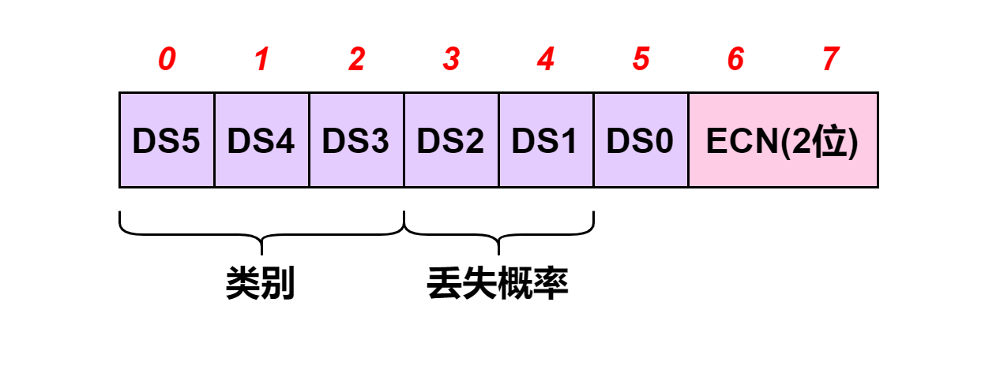

# 数据报中的 DS、ECN 字段

在讲 DS 字段和 ECN 字段之前，我们先来看一下原始的 **服务类型** 字段\[RFC0791]。

服务类型字段提供了所需服务质量的抽象参数的显示。当通过特定网络传输数据报时，这些参数将用于指示实际服务参数的选择。一些网络提供服务优先级，这在某种程度上将高优先级流量视为比其他流量更重要的流量。主要是在低延迟、高可靠性和高吞吐量之间进行三方权衡。

<mark style="color:blue;">**优先级(Precedence)**</mark> 子字段占 `3` 位，用于表示哪些分组具有更高优先级(较大的值意味着更高的优先级)。优先级取值范围为 `000` 到 `111` ，表示优先级从低到高。

下表为原始的 IPv4 服务类型优先级子字段值及对应的名称。

| 优先级子字段值 | 优先级名称                      |
| ------- | -------------------------- |
| 000     | 常规(Routine)                |
| 001     | 优先(Priority)               |
| 010     | 立即(Immediate)              |
| 011     | 瞬间(Flash)                  |
| 100     | 瞬间覆盖(Flash Override)       |
| 101     | 严重(CRITIC/ECP)             |
| 110     | 网间控制(Internetwork Control) |
| 111     | 网络控制(Network Control)      |

<mark style="color:blue;">**D**</mark> 、 <mark style="color:blue;">**T**</mark> 和 <mark style="color:blue;">**R**</mark> 子字段各占 `1` 位，分别用于表示 <mark style="color:blue;">**延时**</mark> 、 <mark style="color:blue;">**吞吐量**</mark> 和 <mark style="color:blue;">**可靠性**</mark> 。如果这些字段值为 `1` ，分别对应于低延时、高吞吐量和高可靠性。

| 子字段 | 值为 0 时 | 值为 1 时 |
| --- | ------ | ------ |
| D   | 正常延迟   | 低延迟    |
| T   | 正常吞吐量  | 高吞吐量   |
| R   | 正常可靠性  | 高可靠性   |

最后 `2` 位 <mark style="color:blue;">**保留**</mark> 使用，默认值为 `00` 。

后来，在 IPv4 首部的第三字段，由原来的 `8` 位的服务类型字段划分为 `6` 位的 <mark style="color:blue;">**区分服务(Differentiated Services, DS)**</mark> 字段，和 `2` 位的 <mark style="color:blue;">**显式拥塞通知(ECN)**</mark> <mark style="color:blue;"></mark>字段\[RFC2474, RFC3168, RFC3260]。

区分服务是一个框架和一组标准，用于支持 Internet 上不同类型的服务。IP 数据报以某种方式(通过预定义模式设置某些位)被标记，使它们的转发不同于其他数据报。这样做可能导致网络中排队延时的增加或减少，以及出现其他特殊效果。 DS 字段中的数字称为 <mark style="color:blue;">**区分服务代码点(DSCP)**</mark> 。 Codepoint(“代码点”)指的是预定义的具有特定含义的位。在通常情况下，如果数据报拥有一个分配的 DSCP ，它在通过网络基础设施交付过程中会保持不变。但是，某些策略可能导致一个数据报中的 DSCP 在交付过程中改变。

当通过一台具有内部排队流量的路由器时，首部中的 `2` 位 `ECN` 位用于为数据报标记拥塞标识符。一台持续拥塞的具有 ECN 感知能力的路由器在转发分组时会设置这两位。这种功能的设计思路是，当一个被标记的分组被目的节点接收时，有些协议会发现分组被标记并将这种情况通知发送方，发送方随后会降低发送速度，这样可在路由器因过载而被迫丢弃流量之前缓解拥塞。这种机制是避免或处理网络拥塞的方法之一。

DS 字段的优先级定义在 \[RFC2474] 中。 `6` 位的 `DS` 字段用于保存 `DSCP` ，特定的 DSCP 值通知路由器对接收的数据报进行转发或特殊处理。不同类型的转发处理表示为 <mark style="color:blue;">**每跳行为(PHB)**</mark> ，因此 DSCP 值可有效通知路由器哪种 PHB 被应用于数据报。 `DSCP` 的默认值通常为 `0` 。

DSCP 值被分成 `3` 个池：<mark style="color:blue;">**标准的**</mark>、<mark style="color:blue;">**实验/本地用途的(EXP/LU)**</mark> 和最终打算标准化的 <mark style="color:blue;">**实验/本地用途的(\*)**</mark> 。

| 池(Pool) | 代码点前缀(Codepoint space) | 策略(Assignment Policy) |
| ------- | ---------------------- | --------------------- |
| 1       | xxxxx0                 | 标准的(Standards Action) |
| 2       | xxxx11                 | EXP/LU                |
| 3       | xxxx01                 | EXP/LU(\*)            |

以 `0` 作为结尾的 DSCP 用于 `标准用途` ，以 `1` 作为结尾的 DSCP 用于 `实验` 或 `本地用途` 。以 `01` 作为结尾的 DSCP 最初打算用于实验或本地用途，但最终会走向 `标准化` 。

DS 字段的前 `3` 位为 <mark style="color:blue;">**类型**</mark> 部分，此部分基于原始的服务类型的优先级子字段。

之后的 `2` 位为 <mark style="color:blue;">**丢弃概率**</mark> ，如果路由器被迫丢弃流量，允许路由器确定首先丢弃哪些流量。 `3` 位的类别选择器提供了 `8` 个定义的代码点(称为类别选择代码点)，它们对应于一个指定最小功能集的 `PHB` ，提供与早期的 IP 优先级相似的功能。它们称为类别选择兼容的 PHB ，目的是支持部分兼容的最初定义的 IP 优先级子字段\[RFC0791]。 `xxx000` 形式的代码点总被映射为这种 PHB ，但是其他值也可映射到相同 PHB 。

类别选择器的 DSCP 值，以及\[RFC0791]定义的 IP 优先级字段的相应术语。保证转发(AF)组对固定数量的独立 AF 类别的 IP 分组提供转发，它有效地概括了优先级的概念。某个类别的流量与其他类别的流量分别转发。在一个流量类别中，数据报被分配一个丢弃优先级。在一个类别中，较高丢弃优先级的数据报优先于那些较低丢弃优先级的数据报处理(即以较高优先级转发)。结合流量类别和丢弃优先级，名称 AFij 对应于保证转发类别 i 的丢弃优先级 j 。例如，一个标记为 AF32 的数据报的流量类别为 3 ，丢弃优先级为 2 。

DS 字段值设计为兼容服务类型和 IPv6 流量类别字段中指定的旧优先级子字段。 AF和EF提供比简单的“尽力而为”更好的服务。其中，(i,j)表示中，i、j分别表示流量类别和丢弃优先级。

| 名称          | 值      | 参考文献       | 描述               |
| ----------- | ------ | ---------- | ---------------- |
| CS0         | 000000 | \[RFC2474] | 类别选择(尽力而为/常规)    |
| CSl         | 001000 | \[RFC2474] | 类别选择(优先)         |
| CS2         | 010000 | \[RFC2474] | 类别选择(立即)         |
| CS3         | 011000 | \[RFC2474] | 类别选择(瞬间)         |
| CS4         | 100000 | \[RFC2474] | 类别选择(瞬间覆盖)       |
| CS5         | 101000 | \[RFC2474] | 类别选择(CRITIC/ECP) |
| CS6         | 110000 | \[RFC2474] | 类别选择(网间控制)       |
| CS7         | 111000 | \[RFC2474] | 类别选择(控制)         |
| AF11        | 001010 | \[RFC2597] | 保证转发(1,1)        |
| AF12        | 001100 | \[RFC2597] | 保证转发(1,2)        |
| AF13        | 001110 | \[RFC2597] | 保证转发(1,3)        |
| AF21        | 010010 | \[RFC2597] | 保证转发(2,1)        |
| AF22        | 010100 | \[RFC2597] | 保证转发(2,2)        |
| AF23        | 010110 | \[RFC2597] | 保证转发(2,3)        |
| AF31        | 011010 | \[RFC2597] | 保证转发(3,1)        |
| AF32        | 011100 | \[RFC2597] | 保证转发(3,2)        |
| AF33        | 011110 | \[RFC2597] | 保证转发(3,3)        |
| AF41        | 100010 | \[RFC2597] | 保证转发(4,1)        |
| AF42        | 100100 | \[RFC2597] | 保证转发(4,2)        |
| AF43        | 100110 | \[RFC2597] | 保证转发(4,3)        |
| EF PHB      | 101110 | \[RFC3246] | 加速转发             |
| VOICE-ADMIT | 101100 | \[RFC5865] | 容量许可的流量          |

加速转发(EF) 提供了非拥塞的网络服务，也就是说，EF流量应享受较低的延时、抖动和丢包率。直观地说，EF流量要求路由器的输出速率至少比输入速率大。因此，在一台路由器的队列中，EF流量仅排在其他EF流量之后。
