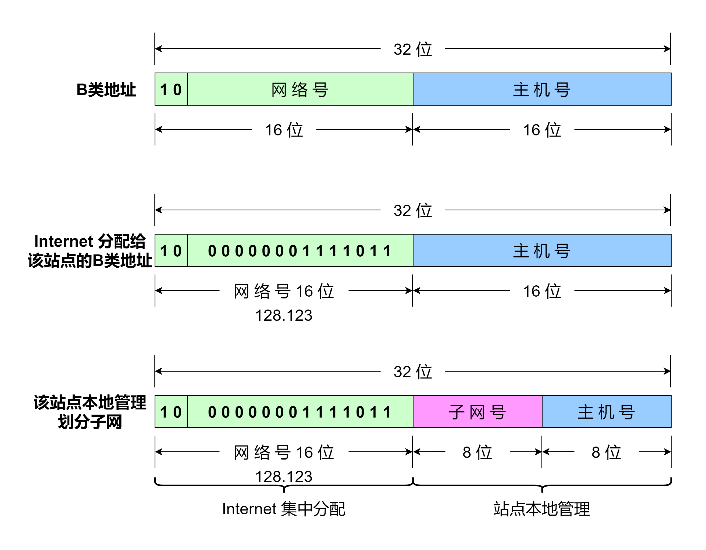
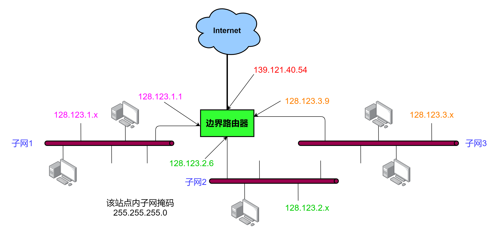
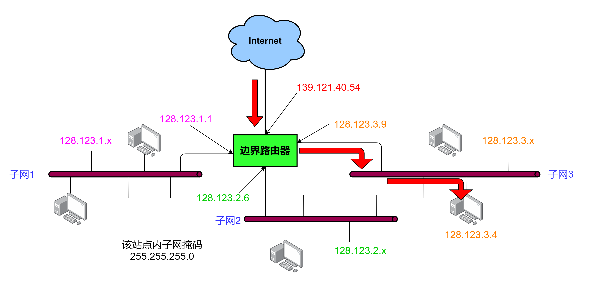

# 子网寻址

IP 地址分为五类，单播地址有三类。随着网络的发展，如果都为接入 Internet 的新网段分配一个新网络号，例如一个 A 类地址，网络号只有 `8` 位，剩余 `24` 位都是主机号，也就是说分配一个新的 A 类地址网络号，此网络中可以容纳 $$2^{24} - 2$$ 台主机。事实上，在一个网络号中人们并不安排这么多主机，这样划分也很难管理，于是有了划分子网的思想。具体做法就是在一个站点接入 Internet 后为其分配一个 A 类、B 类或者 C 类的网络号，保留剩余主机号进一步用于站点内分配。然后再由此站点的管理员进一步划分本地的子网。也就是在站点内，站点管理员把剩余的主机号再进一步划分为一个子网号和一个主机号。这样就能把 IP 地址看作由一个 **网络号** 、一个 **子网号** 和一个 **主机号** 组成。子网号和主机号的划分由站点管理员指定，只有划分子网的网络中的主机和路由器知道子网结构。现在所有的主机都要求支持子网寻址\[RFC 950]\(RFC 950 在线阅读地址 https://www.rfc-editor.org/rfc/rfc950.html )。

下面是一个被站点管理员划分子网的例子。在 RFC 950 文档中，举的例子是 B 类地址主机号划分为 `6` 位的子网号和 `10` 位的子网中的主机号。但为了下面直观地表示 IP 地址中的子网号和主机号(毕竟子网的划分也是由站点管理员指定的)，这里直接把 B 类地址主机号划分为 `8` 位 _子网号_ 和 `8` 位 _主机号_ 。

Internet 中给这个站点分配了一个 B 类网络号，网络号为 `10000000 01111011` 即 `128.123` ，该站点划分了 `8` 位 **子网号** 和 `8` 位 **主机号** ，即该站点划分为 $$2^{8} = 256$$ 个子网，每个子网最多能包含 $$2^{8} - 2 = 254$$ 台主机。

假设有一个站点，该站点通过一个边界路由器连接 Internet 和三个局域网(如上图)。`x` 的值可以是 `0 ~ 255` 范围内的任意值（包括 `0` 和 `255` ）。整体分配给该站点的 B 类地址的网络号为 `128.123` 。如果 Internet 中的其他主机要访问此站点中的主机，都要通过此边界路由器，此边界路由器的接口 IP 地址为 `139.121.40.54` ，在边界路由器中，我们可以通过配置相应的参数，使从 Internet 发送来的数据经边界路由器转发到不同的子网。例如一个数据包要发送到 `128.123.3.4` ，它先从边界路由器接口 IP 地址 `139.121.40.54` 进入，通过边界路由器接口 IP 地址 `128.123.3.9` 转发到 `子网3` ，最后通过子网3送达 `128.123.3.4` (如下图)。

