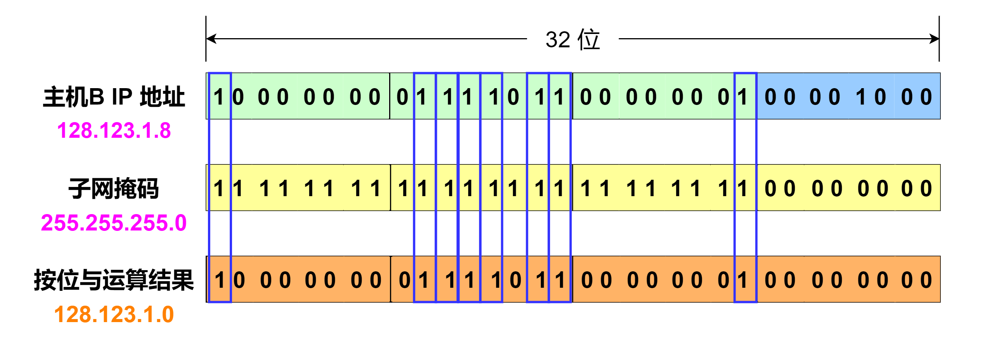

# 子网掩码

在上一次图解子网划分中，我们已经讲到了如何把 IP 地址进一步划分为子网号和主机号，但在网络中要如何识别哪些位是网络号，哪些位又是主机号呢？这里就要使用子网掩码了。 **子网掩码(subnet mask)** 又称网络掩码、地址掩码，它用来指明一个 IP 地址的哪些位标识的是主机所在的子网，以及哪些位标识的是主机的位掩码。子网掩码的作用就是将某个 IP 地址划分成网络地址和主机地址两部分。 IP 子网掩码与对应的 IP 地址长度相同，在 IPv4 中为 `32` 位，在 IPv6 中为 `128` 位。子网掩码通常在一台主机或者路由器中以 IP 地址相同的方式配置，可以是静态的也可以是动态的。在 IPv4 中，子网掩码还是以点分十进制表示。连续的掩码 `1` 表示网络号的长度，连续的掩码 `0` 表示主机号的长度，即对应网络地址的所有位都是为 `1` ，对应于主机地址的所有位都为 `0` 。子网掩码告知路由器，地址的哪一部分是网络地址，哪一部分是主机地址。当然，为了更加方便地表示，一般在 IP 地址后面加上一个斜杠 `/` 和一个数字表示连续 `1` 的个数，这个数字称之为 **前缀长度** 。

一些 IPv4 子网掩码的例子

|     点分十进制表示     |                               二进制表示 | 前缀长度 |
| :-------------: | ----------------------------------: | :--: |
|    128.0.0.0    | 10000000 00000000 00000000 00000000 |  /1  |
|    255.0.0.0    | 11111111 00000000 00000000 00000000 |  /8  |
|   255.255.0.0   | 11111111 11111111 00000000 00000000 |  /16 |
|  255.255.255.0  | 11111111 11111111 11111111 00000000 |  /24 |
| 255.255.255.255 | 11111111 11111111 11111111 11111111 |  /32 |

一些 IPv6 子网掩码的例子

|         十六进制表示        |                                                                                                                                                           二进制表示 | 前缀长度 |
| :-------------------: | --------------------------------------------------------------------------------------------------------------------------------------------------------------: | :--: |
|         ff00::        | 
11111111 00000000 00000000 00000000 00000000 00000000 00000000 00000000 00000000 00000000 00000000 00000000 00000000 00000000 00000000 00000000
 |  /8  |
| ffff:ffff:ffff:ffff:: | 
11111111 11111111 11111111 11111111 11111111 11111111 11111111 11111111 00000000 00000000 00000000 00000000 00000000 00000000 00000000 00000000
 |  /64 |

通过子网掩码，能判断两台主机是否属于同一子网，具体的计算方法是分别将主机的 IP 地址和子网掩码进行二进制按位与运算，得到的结果我们称之为 **网络标识符** （或者称为 **前缀** ），如果网络标识符是相同的，那么这两台计算机就属于同一网段。

下面来看一个例子，假设有三台主机， `主机A` 的 IP 地址为 `128.123.1.3` ， `主机B` 的 IP 地址为 `128.123.1.8` ， `主机C` 的 IP 地址为 `128.123.2.4` ，将它们的 IP 地址分别和该站点的子网掩码进行按位与运算。

.png>)

可以得出 `主机A` 与子网掩码按位与运算后的结果为 `128.123.1.0` ， `主机B` 与子网掩码按位与运算后的结果为 `128.123.1.0` ， `主机C` 与子网掩码按位与运算后的结果为 `128.123.2.0` ， `主机A` 和 `主机B` 与子网掩码按位与运算后的结果相同，说明 `主机A` 和 `主机B` 属于同一个网段，即都属于子网 `128.123.1.0/24` ，而 `主机C` IP 地址属于子网 `128.123.2.0/24` 。该网络的拓扑图如下。

当然，现在的大多数主机、路由器和路由协议都支持 `可变长度子网掩码(VLSM)` 。可变长度子网掩码允许一个组织在同一个网络地址空间中使用多个子网掩码，利用可变长度子网掩码可以使管理员把子网继续划分为子网，使寻址效率达到最高。下图的例子是利用 VLSM 扩展子网的拓扑图。在此站点网络中，子网2继续划分子网。

