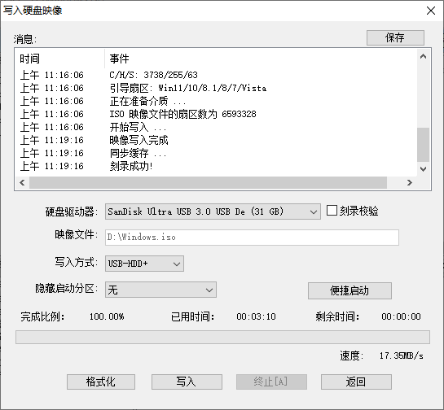
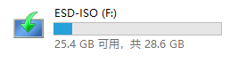

# 如何重装操作系统

一般情况下，我重装系统喜欢用原始方法安装，那就是制作系统 U 盘的方法。

### 选择并下载操作系统镜像

首先，我们肯定要找到适合自己的一款操作系统，当然，前提是符合硬件要求。下面是我一般选择的操作系统下载网站： `MSDN` 。前两年这个网站改版了，更加适合小白。网站上面基本都有适合你的操作系统版本，链接在下面，要的自行保存。

旧版网站地址：

<mark style="color:blue;">https://msdn.itellyou.cn/?lang=zh-cn</mark>

新版网站地址：

<mark style="color:blue;">https://next.itellyou.cn/</mark>

### 下载制作系统 U 盘工具

在网站上面找好操作系统镜像并下载完毕后，我们就可以开始制作系统 U 盘了。在开始制作系统 U 盘之前，我们先到UltraISO软碟通官网下载制作系统 U 盘的工具。

UltraISO 软碟通官网下载地址：

<mark style="color:blue;">https://cn.ultraiso.net/xiazai.html</mark>

这里我们选择免费下载试用即可。

### 制作系统 U 盘

UltraISO 软碟通下载并安装完成后，我们就以管理员身份运行该软件。可以看到如下的软件界面：

接着，我们在电脑上插入容量比较大的 U 盘，因为系统镜像一般比较大，一般我用的 U 盘都是 32 GB 的。

插入 U 盘完毕后，首先最重要的事情就是检查 U 盘里面还有没有需要留住的文件，制作操作系统 U 盘会导致 U 盘里面的数据被删除，所以一定要记住检查并保存好数据。

接着，我们选择 UltraISO 软碟通的菜单 `文件` -> `打开` ，打开下载好的系统镜像。

打开系统镜像后，可以看到：

接着，我们点击菜单栏的 `启动` -> `写入硬盘映像` ：

可以看到出现了一个 `写入硬盘映像` 窗口，这里默认会选择刚刚我们插入电脑的 U 盘，插入多个 U 盘的话记得选择要制作系统 U 盘的那个，接着我们点击 `写入` ，软件就会帮助我们制作系统 U 盘，此过程会对 U 盘进行格式化。

等待一段时间后，如果看到窗口的事件栏显示 `写入成功！` 即表示我们制作系统 U 盘成功，我们将该 U 盘弹出即可。

### 安装操作系统

接下来，我们把系统 U 盘插入到要安装操作系统的电脑上，开启该电脑，然后按下 `F12` 选择启动项，如果不是 `F12` 的话请自行百度自己电脑或者主板品牌设置开机启动项的快捷键，选择我们制作的系统 U 盘，列表里面是按 U 盘品牌名称显示的。

此时系统就会自动加载我们制作好的系统盘。

接下来安装操作系统安装引导我们就能安装操作系统了，比较简单这里就没截图了。毕竟是安装操作系统，连操作系统都没有怎么截图。其实是我懒得拍照了。

这一期的教程就到这里了，希望对重装操作系统的小白有所帮助。
