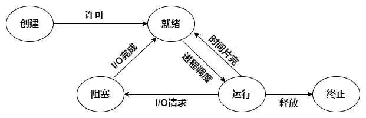

# 进程的状态与转换

### 进程的状态

进程在其生命周期内，由于系统中各进程之间的相互制约关系及系统的运行环境的变化，使得进程的状态也在不断地发生变化。通常进程有以下五种状态，其中前三种是进程的基本状态：

1. <mark style="color:blue;">**运行态**</mark>。进程正在处理机上运行。在单处理机环境下，每个时刻最多只有一个进程处于运行态。
2. <mark style="color:blue;">**就绪态**</mark>。进程获得了<mark style="color:blue;">**除处理机外的一切所需资源**</mark>，一旦得到处理机，便可立即运行。系统中处于就绪状态的进程可能有多个，通常将它们排成一个队列，称为就绪队列。
3. <mark style="color:blue;">**阻塞态**</mark>，又称<mark style="color:blue;">**等待态**</mark>。进程正在等待某一事件而暂停运行，如等待某资源为可用（不包括处理机）或等待输入/输出完成。<mark style="color:blue;">**即使处理机空闲，该进程也不能运行**</mark>。
4. <mark style="color:blue;">**创建态**</mark>。进程正在被创建，尚未转到就绪态。创建进程通常需要多个步骤：首先申请一个空白的 PCB ，并向 PCB 中填写一些控制和管理进程的信息；然后由系统为该进程分配运行时所必需的资源；最后把该进程转入就绪态。
5. <mark style="color:blue;">**结束态**</mark>。进程正从系统中消失，可能是进程正常结束或其他原因中断退出运行。进程需要结束运行时，系统首先必须置该进程为结束态，然后再进一步处理资源释放和回收等工作。

### 进程状态的转换

五种状态之间的转换如下：

* 就绪态 $$\rightarrow$$ 运行态：处于就绪态的进程被调度后，于是进程由就绪态转换为运行态。
* 运行态 $$\rightarrow$$ 就绪态：处于运行态的进程在时间片用完后，不得不让出处理机，从而进程由运行态转换为就绪态。此外，在可剥夺的操作系统中，当有更高优先级的进程就绪时，调度程序将正在执行的进程转换为就绪态，让更高优先级的进程执行。
* 运行态 $$\rightarrow$$ 阻塞态：进程请求某一资源（如外设）的使用和分配或等待某一事件的发生（如I/O操作的完成）时，它就从运行态转换为阻塞态。进程以系统调用的形式请求操作系统提供服务，这是一种特殊的、由运行用户态程序调用操作系统内核过程的形式。
* 阻塞态 $$\rightarrow$$ 就绪态：进程等待的事件到来时，如I/O操作结束或中断结束时，中断处理程序必须把相应进程的状态由阻塞态转换为就绪态。

一个进程从运行态变成阻塞态是<mark style="color:blue;">**主动**</mark>的行为，而从阻塞态变成就绪态是<mark style="color:blue;">**被动**</mark>的行为，需要其他相关进程的协助。
