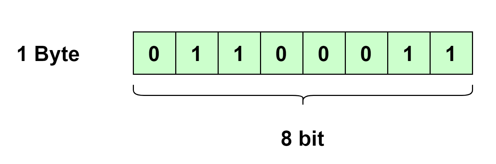
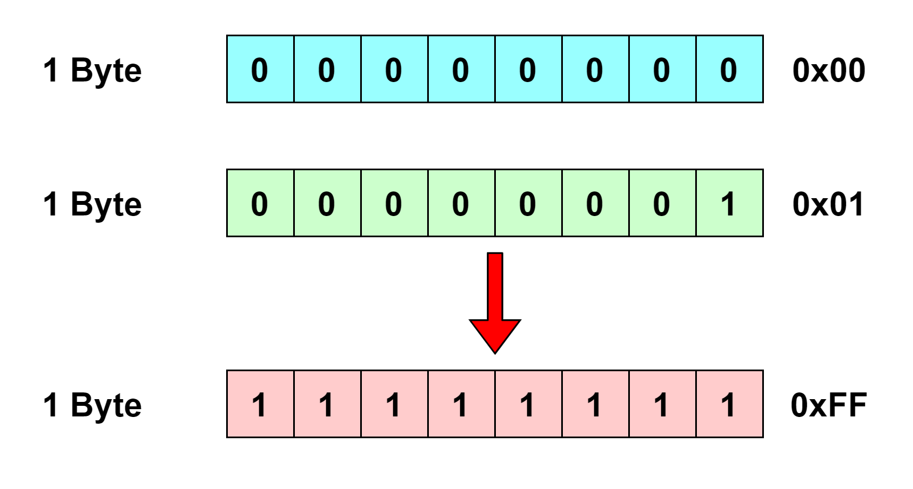
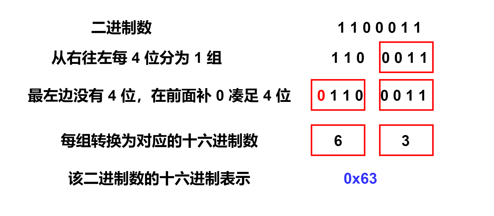

# 计算机信息的表示

大家都知道在计算机中信息都是用 `0` 和 `1` 来表示的。大多数计算机使用 **8 位(bit)** 即 **1 字节(Byte)** 大小的块作为最小的可寻址的内存单元。大部分现代系统都使用 **ASCII 标准** 来表示文本字符，这种方法就是使用一个唯一的单字节大小单元的整数值来表示每个字符。例如，下面的图展示了一个单字节内存单元，其值为 $$(0110 0011)_{2}$$ ，即十进制的 $$99$$ ，查阅 **ASCII 码表** (见文末)，我们可以知道它表示的是字符 `c` 。

机器级程序将内存视为一个非常大的字节数组，称为 **虚拟内存(virtual memory)** 。内存的每个字节都对应有一个 **地址(address)** ，所有可能地址的集合称为 **虚拟内存地址空间(virtual address space)** 。

### 十六进制表示法

计算机中所有信息都是采用二进制数来表示的。一个最小的可寻址内存单元可以存储的值的范围是 $$(00 00 00 00){2}$$_ 到  _$$(11 11 11 11){2}$$ ，即十进制的 `0` 到 `255` 共 `256` 种取值。但为了表示方便，我们通常采用 **十六进制(hexadecimal)表示法** 表示，即 $$(00){16}$$_ 到 _$$(FF){16}$$ 。

在 C 语言中，以 `0x` 或者 `0X` 开头的数字常量表示十六进制的值，这里的字符使用小写或者大写都行。所以，在以后的文章中我都统一采用这种表示方法来表示十六进制数值。

### 二进制转十六进制

那么问题就来了，如何把计算机二进制表示的数值转换为十六进制呢？下面介绍一个简单的方法，因为 $$16 = 2^{4}$$ ，所以我们可以从右至左，把二进制数每 `4` 位划分为一组，然后把每组二进制数直接转换为对应的十六进制数，最后把每个十六进制数连起来，就是该二进制数对应的十六进制表示。当然，如果最左边一组没有 `4` 位，则在前面补 `0` ，补足 `4` 位以后，再把其转成十六进制。下面是一个例子，该二进制数为 $$(1100011)_{2}$$ ，经过相应转换，其十六进制表示为 $$0x63$$ 。

有时，我们会遇到值 x 是 2 的非负整数 n 次幂这种情况，即 $$x = 2^{n} = 10···0(n个0) (n \geqslant 0)$$ 。我们可以使用下面的等式快速计算出其对应的十六进制值。

$$n = i + 4j (0 \leqslant i \leqslant 3)$$

首先，我们将 n 转换为上述式子的表示，然后根据 i 和 j 的值按下面的方法直接表示出来。

__$$i = 0 \rightarrow (1){16}$$_ 后面补上 _$$j$$_ 个 _$$(0){16}$$&#x20;

$$i = 1 \rightarrow (2){16}$$_ 后面补上  _$$j$$_ 个 _$$(0){16}$$__

__$$i = 2 \rightarrow (4){16}$$_ 后面补上  _$$j$$_ 个 _$$(0){16}$$__

__$$i = 3 \rightarrow (8){16}$$_ 后面补上  _$$j$$_ 个 _$$(0){16}$$__

下面是一个例子，当 $$n = 11$$ 即该数为 $$2^{11}$$ 时，我们可以把其表示为 $$2^{11} = 2^{3 + 4 * 2}$$ ，即 $$i = 3$$ ，$$j = 2$$ ，按上面的公式： $$i = 3 \rightarrow (8){16}$$_ ，_$$j = 2 \rightarrow 后面补上 2 个 (0){16}$$ ，最终结果就为 $$0x800$$ 。

### 十六进制转二进制

讲完了二进制数转十六进制数，顺便讲一讲十六进制数转二进制数。方法很简单，就按二进制数转十六进制数的方法反过来就可以，把每位十六进制数转成对应的 `4` 位二进制数即可，这里就不再举例说明。

### ASCII 码表

|                     |                     |                     |                      |                             |        |   |
| ------------------- | ------------------- | ------------------- | -------------------- | --------------------------- | ------ | - |
| 
Bin (二进制)
 | 
Oct (八进制)
 | 
Dec (十进制)
 | 
Hex (十六进制)
 | 缩写/字符                       | 解释     |   |
| 0000 0000           | 00                  | 0                   | 0x00                 | NUL(null)                   | 空字符    |   |
| 0000 0001           | 01                  | 1                   | 0x01                 | SOH(start of headline)      | 标题开始   |   |
| 0000 0010           | 02                  | 2                   | 0x02                 | STX (start of text)         | 正文开始   |   |
| 0000 0011           | 03                  | 3                   | 0x03                 | ETX (end of text)           | 正文结束   |   |
| 0000 0100           | 04                  | 4                   | 0x04                 | EOT (end of transmission)   | 传输结束   |   |
| 0000 0101           | 05                  | 5                   | 0x05                 | ENQ (enquiry)               | 请求     |   |
| 0000 0110           | 06                  | 6                   | 0x06                 | ACK (acknowledge)           | 收到通知   |   |
| 0000 0111           | 07                  | 7                   | 0x07                 | BEL (bell)                  | 响铃     |   |
| 0000 1000           | 010                 | 8                   | 0x08                 | BS (backspace)              | 退格     |   |
| 0000 1001           | 011                 | 9                   | 0x09                 | HT (horizontal tab)         | 水平制表符  |   |
| 0000 1010           | 012                 | 10                  | 0x0A                 | LF (NL line feed, new line) | 换行键    |   |
| 0000 1011           | 013                 | 11                  | 0x0B                 | VT (vertical tab)           | 垂直制表符  |   |
| 0000 1100           | 014                 | 12                  | 0x0C                 | FF (NP form feed, new page) | 换页键    |   |
| 0000 1101           | 015                 | 13                  | 0x0D                 | CR (carriage return)        | 回车键    |   |
| 0000 1110           | 016                 | 14                  | 0x0E                 | SO (shift out)              | 不用切换   |   |
| 0000 1111           | 017                 | 15                  | 0x0F                 | SI (shift in)               | 启用切换   |   |
| 0001 0000           | 020                 | 16                  | 0x10                 | DLE (data link escape)      | 数据链路转义 |   |
| 0001 0001           | 021                 | 17                  | 0x11                 | DC1 (device control 1)      | 设备控制1  |   |
| 0001 0010           | 022                 | 18                  | 0x12                 | DC2 (device control 2)      | 设备控制2  |   |
| 0001 0011           | 023                 | 19                  | 0x13                 | DC3 (device control 3)      | 设备控制3  |   |
| 0001 0100           | 024                 | 20                  | 0x14                 | DC4 (device control 4)      | 设备控制4  |   |
| 0001 0101           | 025                 | 21                  | 0x15                 | NAK (negative acknowledge)  | 拒绝接收   |   |
| 0001 0110           | 026                 | 22                  | 0x16                 | SYN (synchronous idle)      | 同步空闲   |   |
| 0001 0111           | 027                 | 23                  | 0x17                 | ETB (end of trans. block)   | 结束传输块  |   |
| 0001 1000           | 030                 | 24                  | 0x18                 | CAN (cancel)                | 取消     |   |
| 0001 1001           | 031                 | 25                  | 0x19                 | EM (end of medium)          | 媒介结束   |   |
| 0001 1010           | 032                 | 26                  | 0x1A                 | SUB (substitute)            | 代替     |   |
| 0001 1011           | 033                 | 27                  | 0x1B                 | ESC (escape)                | 换码(溢出) |   |
| 0001 1100           | 034                 | 28                  | 0x1C                 | FS (file separator)         | 文件分隔符  |   |
| 0001 1101           | 035                 | 29                  | 0x1D                 | GS (group separator)        | 分组符    |   |
| 0001 1110           | 036                 | 30                  | 0x1E                 | RS (record separator)       | 记录分隔符  |   |
| 0001 1111           | 037                 | 31                  | 0x1F                 | US (unit separator)         | 单元分隔符  |   |
| 0010 0000           | 040                 | 32                  | 0x20                 | (space)                     | 空格     |   |
| 0010 0001           | 041                 | 33                  | 0x21                 | !                           | 叹号     |   |
| 0010 0010           | 042                 | 34                  | 0x22                 | "                           | 双引号    |   |
| 0010 0011           | 043                 | 35                  | 0x23                 | #                           | 井号     |   |
| 0010 0100           | 044                 | 36                  | 0x24                 | $                           | 美元符    |   |
| 0010 0101           | 045                 | 37                  | 0x25                 | %                           | 百分号    |   |
| 0010 0110           | 046                 | 38                  | 0x26                 | &                           | 和号     |   |
| 0010 0111           | 047                 | 39                  | 0x27                 | '                           | 闭单引号   |   |
| 0010 1000           | 050                 | 40                  | 0x28                 | (                           | 开括号    |   |
| 0010 1001           | 051                 | 41                  | 0x29                 | )                           | 闭括号    |   |
| 0010 1010           | 052                 | 42                  | 0x2A                 | \*                          | 星号     |   |
| 0010 1011           | 53                  | 43                  | 0x2B                 | +                           | 加号     |   |
| 0010 1100           | 54                  | 44                  | 0x2C                 | ,                           | 逗号     |   |
| 0010 1101           | 55                  | 45                  | 0x2D                 | -                           | 减号/破折号 |   |
| 0010 1110           | 56                  | 46                  | 0x2E                 | .                           | 句号     |   |
| 0010 1111           | 57                  | 47                  | 0x2F                 | /                           | 斜杠     |   |
| 0011 0000           | 60                  | 48                  | 0x30                 | 0                           | 字符0    |   |
| 0011 0001           | 61                  | 49                  | 0x31                 | 1                           | 字符1    |   |
| 0011 0010           | 62                  | 50                  | 0x32                 | 2                           | 字符2    |   |
| 0011 0011           | 63                  | 51                  | 0x33                 | 3                           | 字符3    |   |
| 0011 0100           | 64                  | 52                  | 0x34                 | 4                           | 字符4    |   |
| 0011 0101           | 65                  | 53                  | 0x35                 | 5                           | 字符5    |   |
| 0011 0110           | 66                  | 54                  | 0x36                 | 6                           | 字符6    |   |
| 0011 0111           | 67                  | 55                  | 0x37                 | 7                           | 字符7    |   |
| 0011 1000           | 70                  | 56                  | 0x38                 | 8                           | 字符8    |   |
| 0011 1001           | 71                  | 57                  | 0x39                 | 9                           | 字符9    |   |
| 0011 1010           | 72                  | 58                  | 0x3A                 | :                           | 冒号     |   |
| 0011 1011           | 73                  | 59                  | 0x3B                 | ;                           | 分号     |   |
| 0011 1100           | 74                  | 60                  | 0x3C                 | <                           | 小于     |   |
| 0011 1101           | 75                  | 61                  | 0x3D                 | =                           | 等号     |   |
| 0011 1110           | 76                  | 62                  | 0x3E                 | >                           | 大于     |   |
| 0011 1111           | 77                  | 63                  | 0x3F                 | ?                           | 问号     |   |
| 0100 0000           | 100                 | 64                  | 0x40                 | @                           | 电子邮件符号 |   |
| 0100 0001           | 101                 | 65                  | 0x41                 | A                           | 大写字母A  |   |
| 0100 0010           | 102                 | 66                  | 0x42                 | B                           | 大写字母B  |   |
| 0100 0011           | 103                 | 67                  | 0x43                 | C                           | 大写字母C  |   |
| 0100 0100           | 104                 | 68                  | 0x44                 | D                           | 大写字母D  |   |
| 0100 0101           | 105                 | 69                  | 0x45                 | E                           | 大写字母E  |   |
| 0100 0110           | 106                 | 70                  | 0x46                 | F                           | 大写字母F  |   |
| 0100 0111           | 107                 | 71                  | 0x47                 | G                           | 大写字母G  |   |
| 0100 1000           | 110                 | 72                  | 0x48                 | H                           | 大写字母H  |   |
| 0100 1001           | 111                 | 73                  | 0x49                 | I                           | 大写字母I  |   |
| 0100 1010           | 112                 | 74                  | 0x4A                 | J                           | 大写字母J  |   |
| 0100 1011           | 113                 | 75                  | 0x4B                 | K                           | 大写字母K  |   |
| 0100 1100           | 114                 | 76                  | 0x4C                 | L                           | 大写字母L  |   |
| 0100 1101           | 115                 | 77                  | 0x4D                 | M                           | 大写字母M  |   |
| 0100 1110           | 116                 | 78                  | 0x4E                 | N                           | 大写字母N  |   |
| 0100 1111           | 117                 | 79                  | 0x4F                 | O                           | 大写字母O  |   |
| 0101 0000           | 120                 | 80                  | 0x50                 | P                           | 大写字母P  |   |
| 0101 0001           | 121                 | 81                  | 0x51                 | Q                           | 大写字母Q  |   |
| 0101 0010           | 122                 | 82                  | 0x52                 | R                           | 大写字母R  |   |
| 0101 0011           | 123                 | 83                  | 0x53                 | S                           | 大写字母S  |   |
| 0101 0100           | 124                 | 84                  | 0x54                 | T                           | 大写字母T  |   |
| 0101 0101           | 125                 | 85                  | 0x55                 | U                           | 大写字母U  |   |
| 0101 0110           | 126                 | 86                  | 0x56                 | V                           | 大写字母V  |   |
| 0101 0111           | 127                 | 87                  | 0x57                 | W                           | 大写字母W  |   |
| 0101 1000           | 130                 | 88                  | 0x58                 | X                           | 大写字母X  |   |
| 0101 1001           | 131                 | 89                  | 0x59                 | Y                           | 大写字母Y  |   |
| 0101 1010           | 132                 | 90                  | 0x5A                 | Z                           | 大写字母Z  |   |
| 0101 1011           | 133                 | 91                  | 0x5B                 | \[                          | 开方括号   |   |
| 0101 1100           | 134                 | 92                  | 0x5C                 | \\                          | 反斜杠    |   |
| 0101 1101           | 135                 | 93                  | 0x5D                 | ]                           | 闭方括号   |   |
| 0101 1110           | 136                 | 94                  | 0x5E                 | ^                           | 脱字符    |   |
| 0101 1111           | 137                 | 95                  | 0x5F                 | \_                          | 下划线    |   |
| 0110 0000           | 140                 | 96                  | 0x60                 | \`                          | 开单引号   |   |
| 0110 0001           | 141                 | 97                  | 0x61                 | a                           | 小写字母a  |   |
| 0110 0010           | 142                 | 98                  | 0x62                 | b                           | 小写字母b  |   |
| 0110 0011           | 143                 | 99                  | 0x63                 | c                           | 小写字母c  |   |
| 0110 0100           | 144                 | 100                 | 0x64                 | d                           | 小写字母d  |   |
| 0110 0101           | 145                 | 101                 | 0x65                 | e                           | 小写字母e  |   |
| 0110 0110           | 146                 | 102                 | 0x66                 | f                           | 小写字母f  |   |
| 0110 0111           | 147                 | 103                 | 0x67                 | g                           | 小写字母g  |   |
| 0110 1000           | 150                 | 104                 | 0x68                 | h                           | 小写字母h  |   |
| 0110 1001           | 151                 | 105                 | 0x69                 | i                           | 小写字母i  |   |
| 0110 1010           | 152                 | 106                 | 0x6A                 | j                           | 小写字母j  |   |
| 0110 1011           | 153                 | 107                 | 0x6B                 | k                           | 小写字母k  |   |
| 0110 1100           | 154                 | 108                 | 0x6C                 | l                           | 小写字母l  |   |
| 0110 1101           | 155                 | 109                 | 0x6D                 | m                           | 小写字母m  |   |
| 0110 1110           | 156                 | 110                 | 0x6E                 | n                           | 小写字母n  |   |
| 0110 1111           | 157                 | 111                 | 0x6F                 | o                           | 小写字母o  |   |
| 0111 0000           | 160                 | 112                 | 0x70                 | p                           | 小写字母p  |   |
| 0111 0001           | 161                 | 113                 | 0x71                 | q                           | 小写字母q  |   |
| 0111 0010           | 162                 | 114                 | 0x72                 | r                           | 小写字母r  |   |
| 0111 0011           | 163                 | 115                 | 0x73                 | s                           | 小写字母s  |   |
| 0111 0100           | 164                 | 116                 | 0x74                 | t                           | 小写字母t  |   |
| 0111 0101           | 165                 | 117                 | 0x75                 | u                           | 小写字母u  |   |
| 0111 0110           | 166                 | 118                 | 0x76                 | v                           | 小写字母v  |   |
| 0111 0111           | 167                 | 119                 | 0x77                 | w                           | 小写字母w  |   |
| 0111 1000           | 170                 | 120                 | 0x78                 | x                           | 小写字母x  |   |
| 0111 1001           | 171                 | 121                 | 0x79                 | y                           | 小写字母y  |   |
| 0111 1010           | 172                 | 122                 | 0x7A                 | z                           | 小写字母z  |   |
| 0111 1011           | 173                 | 123                 | 0x7B                 | {                           | 开花括号   |   |
| 0111 1100           | 174                 | 124                 | 0x7C                 | \|                          | 垂线     |   |
| 0111 1101           | 175                 | 125                 | 0x7D                 | }                           | 闭花括号   |   |
| 0111 1110           | 176                 | 126                 | 0x7E                 | \~                          | 波浪号    |   |
| 0111 1111           | 177                 | 127                 | 0x7F                 | DEL (delete)                | 删除     |   |
