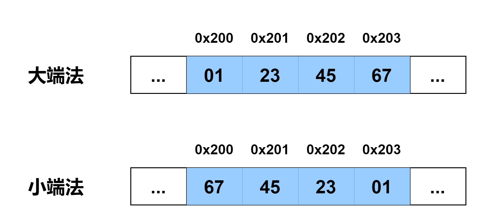

# 数据大小以及字节存储顺序

### 数据大小

每台计算机都有这样一个称为 **字(word)** 的数据单位，它用来表示该计算机一次性处理事务的固定长度。一个字的位数称之为 **字长(word size)** ，是用来指明指针数据的 **标称大小(nominal size)** 。通常情况下，我们称处理字长为 32 位的 CPU 叫 `32 位 CPU` ，也就是说， `32 位 CPU` 在同一个时间里能一次性处理字长 32 位的二进制数据。当然，这里要强调一个字究竟是等于多少字节的问题， `32 位 CPU` 一个字等于 `4` 个字节，但 `64 位 CPU` 一个字等于 `8` 个字节，也就是说字长与处理器有关，不同处理器有着不同的字长。

字长为 $$w$$ 位的机器，其虚拟地址的范围为 $$0$$ \~ $$2^{w} - 1$$，程序最多访问 $$2^{w}$$ 个字节(Byte)。

在 C 语言中， C 为不同的数据类型分配了相应的字节大小，如下表所示，当然也可能随机器和编译器的不同而有所不同。

| C 声明           | 字节数            |      |      |
| -------------- | -------------- | ---- | ---- |
| 有符号            | 无符号            | 32 位 | 64 位 |
| \[signed] char | unsigned char  | 1    | 1    |
| short          | unsigned short | 2    | 2    |
| int            | unsigned       | 4    | 4    |
| long           | unsigned long  | 4    | 8    |
| int32\_t       | uint32\_t      | 4    | 4    |
| int64\_t       | uint64\_t      | 8    | 8    |
| char \*        |                | 4    | 8    |
| float          |                | 4    | 4    |
| double         |                | 8    | 8    |

所以，我们可以看出，分配的字节数是受到程序是如何编译的影响而变化的。

### 存储容量单位

说到数据大小，不得不简单介绍一下计算机存储容量单位。信息存储单位有位、字节和字等几种，当然还有扩展单位 `KB` 、`MB` 等。除了字长和一字节等于八比特位之外，其他的换算率都为 `1024` ，但为了工业制造上的方便，工业制造上的换算率都为 `1000` ，这也是你所购买 `32 G` U 盘实际在电脑上显示不到 `32 G` 容量的原因。各种存储设备存储容量单位有 `KB` 、`MB` 、`GB` 和 `TB` 等几种，相信大家都不陌生，这里就不再赘述。以下给出了各单位的换算公式。

1 B = 8 bit&#x20;

1 KB = 1024 B&#x20;

1 MB = 1024 KB&#x20;

1 GB = 1024 MB&#x20;

1 TB = 1024 GB&#x20;

1 PB = 1024 TB&#x20;

1 EB = 1024 PB&#x20;

1 ZB = 1024 EB&#x20;

1 YB = 1024 ZB&#x20;

1 BB = 1024 YB&#x20;

1 NB = 1024 BB&#x20;

1 DB = 1024 NB&#x20;

1 CB = 1024 DB&#x20;

1 XB = 1024 CB

### 寻址和字节存储顺序

对于一个跨越了几个字节的数据对象，这个数据对象所占据的最低地址就规定为该对象的起始地址。例如，对于一个 `int` 型的变量 `x` ，其值为 `0x01234567` ，假设它的起始地址为 `0x200` ，则这个数据对象所占据的地址总共有 `4` 个，如下图所示，即 `0x200` 、 `0x201` 、 `0x202` 和 `0x203` 。

我们在保存它的值时总是一个字节一个字节地存。当然，这里又引出了一个问题，就是按什么样的字节顺序把这个值放入相应的内存。这里有两种顺序可选：

**小端法(little endian)** ：最低有效字节在最前面。也就是从右至左把每个字节从低地址向高地址依次存入。 **大端法(big endian)** ：最高有效字节在最前面。也就是按我们平常书写的顺序把每个字节从低地址向高地址依次存入。

具体的可以参考上面给出的图。
